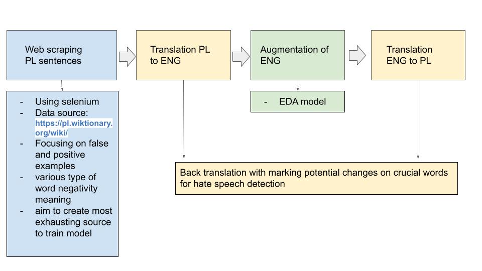

# CodeHateChallenge

# CodeHateChallenge

## Plugin
How to run plugin:

1. Install node.js & npm
2. Run in this directory
   ```
   npm install
   npm start
   
   ```

## Backend

In order to run backend, use:

```
docker-compose up
```

There are 3 APIs available:
* /ping - check if service is alive
* /ishate - checkt if input text is hateful
* /whyhate - obtain explanation for hateful paragraphs

To send API request from CLI, use:

```
curl -X POST -H "Content-Type: text/plain" --data "sample text" -v localhost:8080/ishate
curl -X POST -H "Content-Type: text/plain" --data "sample text" -v localhost:8080/whyhate
curl -X GET localhost:8080/ping
```


## Data augmentation

### Fast pipeline to augment data in any language
Pipeline can ba adopted easily to any language. 
Example pipeline for Polish language:

### Scraping data (positive and negative examples)

The examples utterances (positive and negative) are scrap examples data from the page 
**https://pl.wiktionary.org/wiki/** based on list of offensive words. 
This process enables to increase the number of false-positive examples in the dataset.

Selenium is used to scrap the data. 

How to use:
```
python src/augment/scrap_wiki.py 
d = OffensiveDict("wiki_words2.json")
d.create_csv_with_utterances()
```

Example scraped sentences for word **pies**:
-  Czy to jest **pies** czy suka? " zool. Canis familiaris[1], zwierzę domowe; zob. też pies w Wikipedii" - not offencive example
-  **Psy** stoją na patrolu.,pies," slang. obraź. policjant[3], żandarm lub milicjant" - offencive example 


### EDA
EDA is a package used to augment data in English.  
GIT source: https://github.com/jasonwei20/eda_nlp.git 

Required to do before usage:
- install nltk
```
pip install -U nltk
```
- download wordnet
```
python
>>> import nltk; nltk.download('wordnet')
```
How to augment an English sentence:
```{python}
augmenter = Augmenter()
res = augmenter.augment_text("All black people should be slaves")
```
Example output:
```
['all black people totally should be slaves', 'all black be slaves', 'all black people totally should be slaves', 'all black people should be slaves', 'all black slaves should be people', 'all black people be slaves', 'atomic number all black people should be slaves', 'all shirley temple people should be slaves', 'all black the great unwashed should be slaves', 'all black people should be slaves']

```

### Custom back translation
Require to install:
```
pip install transformers
pip install neptune-client
pip install sentencepiece
pip install fairseq
pip install subword-nmt
```
How to use:
```
augmenter = Augmenter("polish_offensive_dict.json")
augmenter.back_translation("Kurwa, uchodźcy niszczą Polskę, jebane kozojebcy", first_lang="polish", second_lang="english")
```
Example result:
```
>>> Kurwa, uchodźcy niszczą Polskę, wy pierdolone kozie skurwiele.
```

## Models
### BERT UDA
Bert UDA architecture:


### Other models
- [detoxify ](https://github.com/unitaryai/detoxify) (will be used in demo)
- [transformers from huggingface](https://github.com/huggingface/transformers) (trying to find good approach for less popular languages, different experiments conducted)


1. 1 model per language
2. multilingual bert
3. model trained on polish and added translated labeled english examples
4. english pretrained model trained on translated polish tweets and added english examples
5. multilingual model trained on sentences containing original polish tweet + translated
6. small demo of BERT UDA trained on polish tweets (pretrained on polish), with backtranslation (marking translating changes on 'strong' words) and with EDA

(unordered)


Results on small dataset (training ~ 600 examples) composed of 800 examples extracted by our method descibed above 


